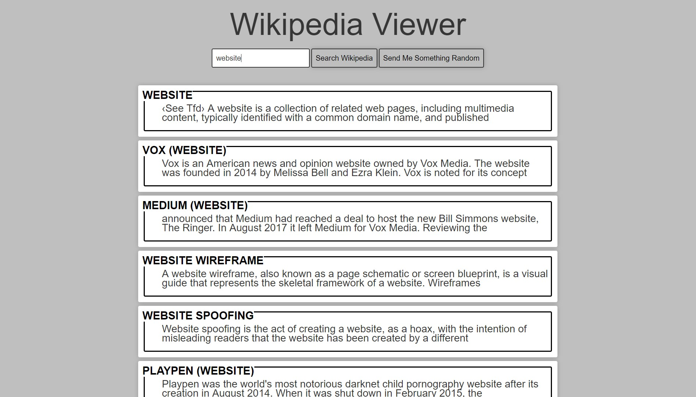

# Wiki_Viewer
Wikipedia Viewer for FreeCodeCamp.

I used the Wikipedia API, Bootstrap CSS CDN plus some JQuery to create the project.    A live demo can be found on my portfolio site- [Richard Southard](https://www.richardsouthard.com/projects/WikiViewer/wiki.html)

This is the final result of the project.

